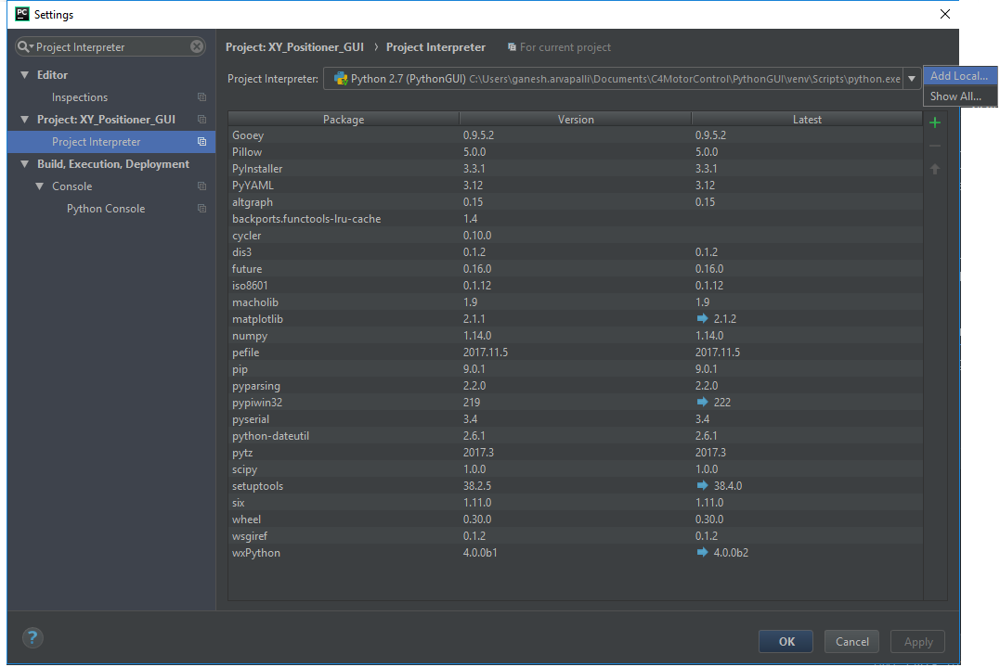
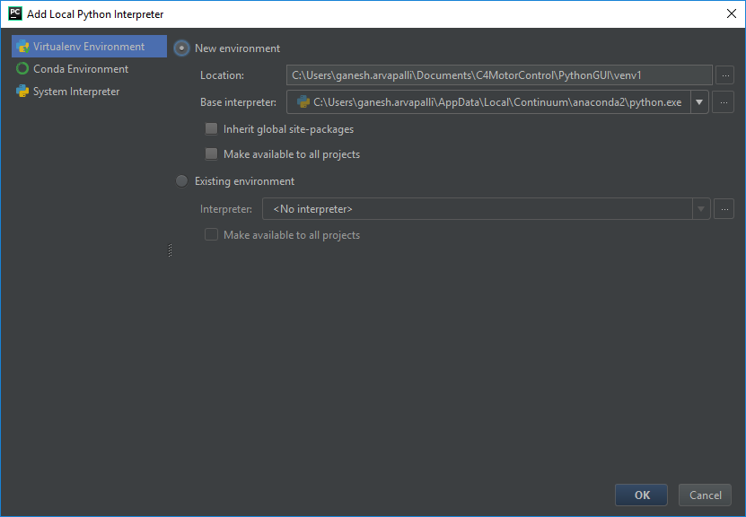
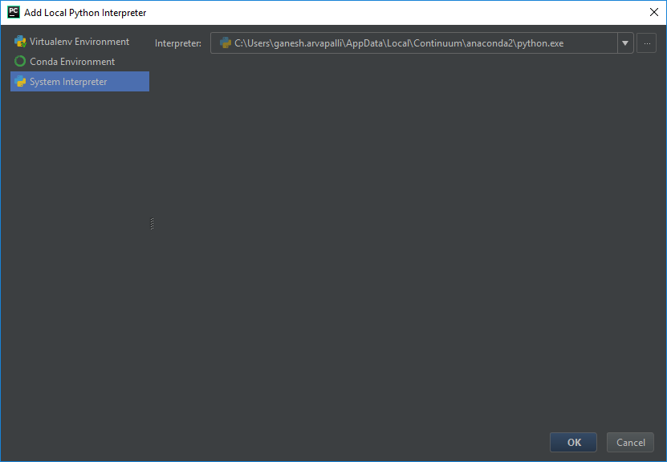
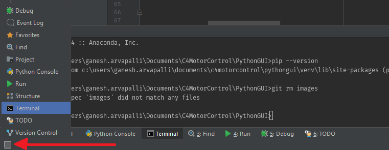

# Robotic Positioning Controller

This project was designed to allow easier use of the Arrick C4 Motor
controllers and generate contour plots based on measurement data. The
code was written in Python 2.7.

## Getting Started

### Prerequisites

What things you need to install the software and how to install them

It is recommended that you install an **I**ntegrated **D**evelopment **E**nvironment (IDE) for viewing and running Python files. [PyCharm](https://www.jetbrains.com/pycharm/download/) is recommended as it does not require admin privileges. 

Spyder should also work and it comes preinstalled with [Anaconda](https://github.com/BurntSushi/nfldb/wiki/Python-&-pip-Windows-installation).
Future versions should include a Jupyter Notebook to make data management testing easier.

It is also assumed that you already have a built XY Positioning system (either 18 or 30 inch model). This code will simply
help make controlling the motors more intuitive.

### Installing

1. First, install the latest version of Python 2.7 from the following [link](https://www.python.org/downloads/). Make sure you
are downloading **Python 2.7** and NOT Python 3. You may also choose to install [Anaconda or Miniconda](https://github.com/BurntSushi/nfldb/wiki/Python-&-pip-Windows-installation) to manage the packages
we will be using.


2. Install an IDE such as [PyCharm](https://www.jetbrains.com/pycharm/download/) or use Spyder (included in Anaconda). Open the folder
containing the files you downloaded using this IDE.

3. Next we must set up our virtual environment to continue using python properly. This can be slightly complicated, so use this link
for [reference for PyCharm](https://www.jetbrains.com/help/pycharm/configuring-python-interpreter.html#configuring-venv) and this link
for [reference for Anaconda](https://conda.io/docs/user-guide/tasks/manage-environments.html). If you have configured the PATH variables
for Windows, this shouldn't be necessary. I will go through the exact steps for PyCharm
here:
    - Go to Help > Find Action in the top bar or press Ctrl+Shift+A
    - Search for "Project Interpreter" and click the first result
    - The term "Project Interpreter" should be highlighted. It is next to a long dropdown bar. Next to that bar is a settings 
    gear icon. Click on it and choose "Add Local"
    
    
    
    - Specify a "Location" for the virtual environment. For the "Base Interpreter", navigate to the folder where you installed Python
    (probably `C:/Python27` or `C:/ProgramFiles/Python27`). Choose the file "python.exe" to make sure PyCharm knows how to run your code.
    
    
    
    - Before you exit out of this window, on the left hand side, there should be an option that says "System Interpreter". For the "Interpreter"
    choose the exact same location you specified for the "Base Interpreter" (the python.exe file from before).
    
    
    
    - Click "Ok" and exit the "Settings" window.

4. You must then open up the "Terminal" inside the IDE you are using to run the following command to install relevant packages.
The button to open it in PyCharm can be found in the very bottom left corner (it looks like a gray square). Hovering over it will allow the
user the option to open the terminal.

    

5. Run the following command in the terminal (within your IDE) to install all packages at once. These packages take up about 1 GB of space:

```bash
pip install numpy matplotlib Gooey pyserial scipy
```

Alternatively, if you are using Anaconda, use the following command:

```bash
conda install numpy matplotlib Gooey pyserial scipy
```

## Deployment

Open the file ["basic_xy_positioner_gui.py"](basic_xy_positioner_gui.py) in your favorite IDE and click run 
(the green play button at the top for PyCharm). If you have to enter run configurations, the only That should be it!

Running from the command line on Linux/Mac systems can be done by simply typing:

```bash
python basic_xy_positioner_gui.py
```

Make sure that it is configured to be executable by using:

```bash
chmod +x basic_xy_positioner_gui.py
```

For Windows 10, you must first configure your PATH variables in order to run python from the command line. Follow the steps
on this [site](https://superuser.com/questions/143119/how-to-add-python-to-the-windows-path) to learn how to add Python to the PATH.
Note that this is completely optional and that the program can still be run through an IDE.

The GUI should pop up with options that you may define. Additional parameters can be tweaked by modifying the source files.

It may be necessary to purchase a USB-to-Serial cable as the one currently in use is liable to
breaking. Ensure that the stopper is in place for motor 1 on the 30 inch system to ensure homing
works correctly.

##### NOTE THAT BEFORE RUNNING ANY SCANS YOU MUST FIRST [RESET THE MOTORS](#resetting-Motors-reset_motors).

### Running an Area Scan (area_scan)

##### Required Arguments

* Input the dimensions of the object (x goes across and is controlled by motor #1, y goes up and down by using motor #2) into *x_distance* and *y_distance*.
* The *grid_step_dist* selects how far apart each measurement point should be.
* The *dwell_time* is by default set to 1, but can be changed to 0 to allow for the user to wait an indefinite amount of time before inputting a value.

##### Optional Arguments

* The *filename* is a prefix that will appear at the beginning of all resulting file output. All output can be found in the folder
`results/` which will be automatically generated if not present.
* The *measure* setting can be turned off to simply observe how the motors are stepping through the grid.
* The *auto_zoom_scan* setting will automatically conduct a zoom scan over the point with the highest value after travelling
to it. Zoom scan data is stored separately from area scan data.

The default settings create a 4x6 grid with spacing of 2.8 cm with a 1 second dwell time. The default file prefix is "raw_values" and the automatic zoom scan is not conducted.

Once the area scan is complete, you may select more options from the post-scan GUI that pops up afterward. You may choose to
* correct a previous value
* run a zoom scan
* save your data into `results/`
* ...or exit the program
 
Note that the plot will also be saved and you do not have to choose the save button on the graph pop up unless you would like 
to save it in another folder.

### Moving to a Grid Position (pos_move)

##### Required Arguments

* Input the dimensions of the object (x goes across and is controlled by motor #1, y goes up and down by using motor #2) into *x_distance* and *y_distance*.
* The *grid_step_dist* selects how far apart each measurement point should be.

After the command is selected, a grid GUI will pop up with a series of buttons. Click on where you want to go within the grid
and the motors will move there after moving to the first position in the grid.

### Running a Zoom Scan

To run a zoom scan over a single point, it is recommended that you first run [pos_move](#moving-to-a-grid-position-pos_move)
and then conduct an area scan with smaller step size.

Make sure to indicate in your filename that you are conducting a zoom scan!
The program is built to assume that if you choose [area_scan](#running-an-area-scan-area_scan), you are expecting data outputted
into a file called "_area".

You can also choose to run a zoom scan after the area scan is complete or set it to be run automatically after an area scan.

### Resetting Motors (reset_motors)

This command resets the motors to their start position at the center of the XY positioner. Please run this command every time you
are finished using the positioner. It will take approximately a minute to complete the reset, but PLEASE DO NOT RUN ANY SCANS while
the motors are moving. This will throw off position calculations. To that effect, check the "wait" box to say that you understand this. :+1:

You may also select whether you would like to go to the center of the 18 inch system or the 30 inch system. ("scan_30")

### Manual Control (manual)

The manual control option assumes that you know your exact positions for grid coordinates and allows for free movement of the motors.

The settings for "up, down, left, and right" may be altered depending on your perspective relative to the positioner. For this reason,
the buttons have been labelled "towards/away" depending on the motor they are associated with.

The distance moved by pressing a button can be changed by using the text boxes in the top right section of the GUI.

To generate a graph (scatter + contour) you require at least 4 data points. To add a data point, type a value into the textbox and click "Add
to graph". Unfortunately, overwriting data points is **not** supported at this time, so be sure of your value before you click "Add to graph"!

Note that this graph IS NOT SAVED unless you click the save button and choose a location/filename.

## Built With

* [Python](https://www.python.org/) - This code base was written in Python 2.7.14
* [PySerial](https://github.com/pyserial/pyserial) - Dependency Management
* [Numpy](http://www.numpy.org/) - Used for matrix manipulations and structuring data
* [Matplotlib](https://matplotlib.org/) - Used for interpolation and contour plotting
* [SciPy](https://www.scipy.org/) - Used for additional interpolation
* [Gooey](https://github.com/chriskiehl/Gooey) - Used to construct initial menu selection

## Contributing

Please read [CONTRIBUTING.md](https://gist.github.com/PurpleBooth/b24679402957c63ec426) for details on our code of conduct, and the process for submitting pull requests.

## Authors

* **Ganesh Arvapalli** - *Software Engineering Intern* - [garva-pctest](https://github.com/garva-pctest)

Originally written for the internal use of PCTEST Engineering Lab, Inc.

## License

This project is licensed under the MIT License - see the [LICENSE.md](LICENSE.md) file for details

## Acknowledgments

* Andrew Harwell
* Baron Chan
* Kaitlin O'Keefe
* Steve Liu
* PCTEST Engineering Lab, Inc.
