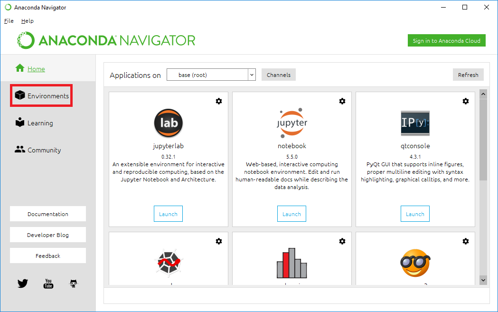
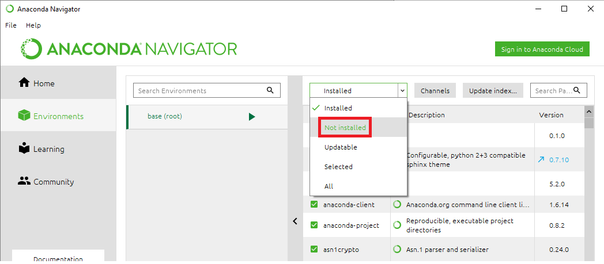
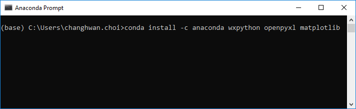
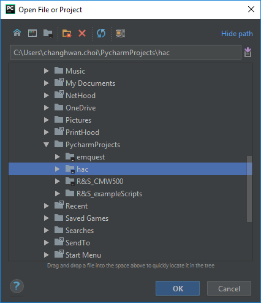
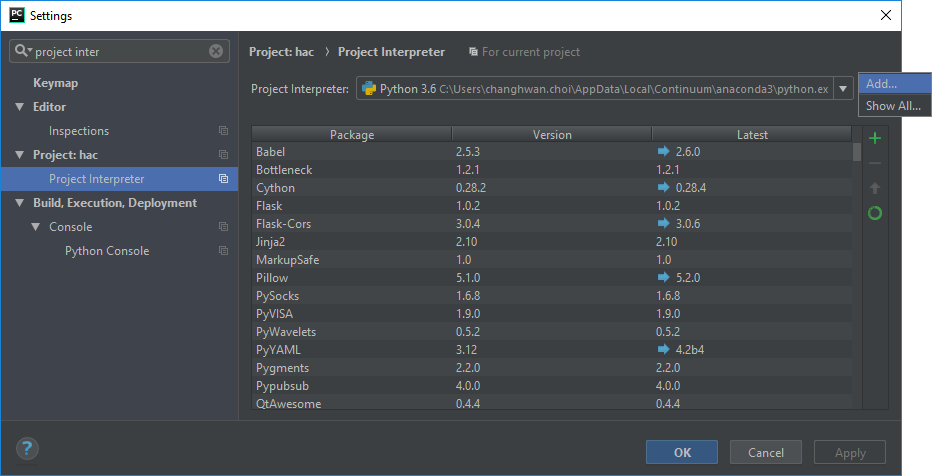
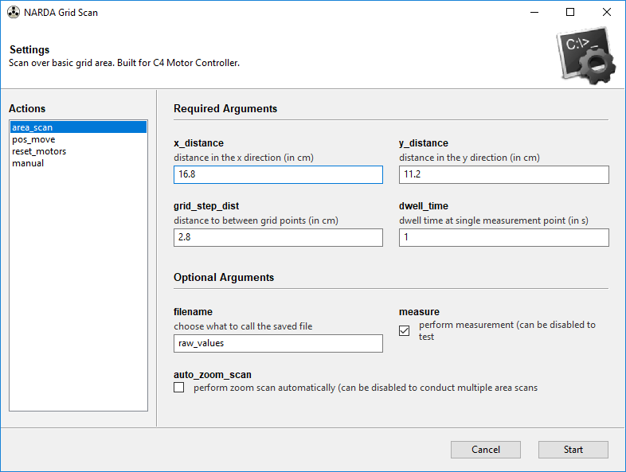
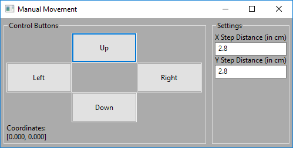

# NS Testing/Robotic Positioning Controller

This project was designed to allow easier use of the Arrick C4 Motor
controllers and generate contour plots based on measurement data.
The project has since been expanded to also incorporate automatic
measurements for nerve stimulation (NS) testing by way of mouse and
keyboard control libraries. The code was written in Python 3.6.
*Note: this version of the program only supports Windows 10 at the moment.

## Getting Started
### Overview
#### Programs
* [Anaconda3/Miniconda3]( https://www.anaconda.com/download/)
   * Python projects often implement a variety of different third party libraries which, as projects scale up, can be hard to manage in an organized fashion. As a Python distribution, Anaconda provides the core Python language, hundreds of core packages, a variety of different development tools (e.g. IDEs), and **conda**, Anaconda’s package manager that facilitates the downloading and management of Python packages.
* [Python 3.6]( https://www.python.org/downloads/) (included in Anaconda3/Miniconda3)
   * Python is the main programming language for this project. It has an active open-source community and easily readable code syntax, making Python a great language of choice for projects like these.
   * **Note: Python 3.6 is included in the Anaconda 3 installation - there is no need to download it separately.**
* An Integrated Development Environment (IDE) supporting Python – [PyCharm]( https://www.jetbrains.com/pycharm/download/) is recommended.
    * While PyCharm is not necessary to run this program, we highly recommend it for Python-based development. It is easy to integrate it with Anaconda and provides fantastic tools/shortcuts/hotkeys that make development faster and easier.
* EHP200-TS (NARDA Software)
    * This is the Program for electric and magnetic field analysis. All measurements are processed and saved through this program.
* Snipping Tool
    * Snipping Tool is used to take screenshots and is a default program in Windows 10.

#### Packages (to be installed using Anaconda)
* [Python](https://www.python.org/)
* [PySerial](https://github.com/pyserial/pyserial)
* [Numpy](http://www.numpy.org/)
* [Matplotlib](https://matplotlib.org/)
* [SciPy](https://www.scipy.org/)
* [wxPython (wx)](https://wxpython.org/)
* [pyautogui](https://pyautogui.readthedocs.io/en/latest/)
* [pywinauto](https://pywinauto.github.io/)
* [pywin32](https://wiki.python.org/moin/PyWin32)

#### Hardware Prerequisites
* [EHP-200A](https://www.narda-sts.com/en/selective-emf/ehp-200a/) - Electric and Magnetic Field Analyzer Probe (NARDA)
* XY Positioning System (18 inch or 30 inch model)
    * C4 Controller
    * MD-2 Stepper Motor Driver

### Installing

A core strength of Python is its vast open-source community and libraries. However, downloading and managing these separate packages is often a messy and tricky endeavor. As such, we used [Anaconda](https://www.anaconda.com/download/) to browse, install, and manage the libraries. While it is possible to follow the general steps in this section through a standard Python installation, we highly recommend using Anaconda/Miniconda.

1. First, install the latest version of [Anaconda](https://www.anaconda.com/download/). Make sure you are downloading Anaconda for **Python 3.X** (Version 3.6 was the latest one at the time of writing this guide). 

2. Install an IDE such as [PyCharm](https://www.jetbrains.com/pycharm/download/). Open the folder containing the files you downloaded using this IDE.

3.	We will now install the different packages required to run the scripts.
  * Open **Anaconda Navigator** and click on **Environments** tab on the left.
  
   
  
  * Select **Not installed** from the dropdown menu.
  
  
  
  * From here, we can search for each of the different packages listed above (in the Packages subsection of the Overview). To download the packages, check the box next to the package and click **Apply** at the bottom. **Keep in mind that some of these packages may already have come with the full Anaconda installation.**
  * Some packages may not be found using the Navigator. In this case, they must be downloaded using **Anaconda Prompt**. Open the prompt and type the following: `conda install -c anaconda <package_names_space-separated>`.
 
  
  
*Note: Alternatively, you can add the packages in the **Project Interpreter** section of the project settings in PyCharm. However, this must be done after the project has been opened and the project interpreter has been selected, which will be done in the next few steps.*

4.	Open PyCharm and open the project – select the **XY_Positioner_GUI** folder in the “Open File or Project” window.

  
  
5.	Select **File->Settings…** and select the **Project Interpreter** tab on the left. Click on the cog and select **Add…**.
  
  
  
  * Click on the **System Interpreter** tab on the left and select the location of the python.exe file from your Anaconda/Miniconda installation (most probably found in `C:\Users\<user>\AppData\Local\Continuum\anaconda3\python.exe` in Windows machines).

## Deployment
Open the file ["xy_positioner_gui.py"](xy_positioner_gui.py) in your favorite IDE and click run 
(the green play button at the top for PyCharm). If you have to enter run configurations, the only That should be it!

In order to run python from the command line, you must first configure your PATH variables. Follow the steps
on this [site](https://superuser.com/questions/143119/how-to-add-python-to-the-windows-path) to learn how to add Python to the PATH.
Note that this is completely optional and that the program can still be run through an IDE.

The GUI should pop up with options that you may define. Additional parameters can be tweaked by modifying the source files.

# TODO: Change image

It may be necessary to purchase a USB-to-Serial cable as the one currently in use is liable to
breaking. Ensure that the stopper is in place for motor 1 on the 30 inch system to ensure homing
works correctly.

##### NOTE THAT BEFORE RUNNING ANY SCANS YOU MUST FIRST [RESET THE MOTORS](#resetting-Motors-reset_motors).

### Running an Area Scan
##### Required Arguments
* Input the dimensions of the object (x goes across and is controlled by motor #1, y goes up and down by using motor #2) into *X Distance* and *Y Distance*.
* *Grid Step Distance* selects how far apart each measurement point should be.
* *Dwell Time Settings* for the time the NS probe spends idle above a point before a measurement is taken.
* The *Span Settings* for the FFT band limits.
* *Save Directory* to save all the output files from the auto measurements.
* *Test Information* to save current test run info (i.e. Test engineer initials, test number, EUT serial number).
* *Measurement Specifications* to select the measurement field, type, side, and RBW.

The default settings create a 4x6 grid with spacing of 2.8 cm with a 3-second dwell time (for both area scan and zoom scan). Span settings are set to be between 0.005 - 5 MHz.

#### General Area Scan
The main function of this program is the general area scan. This consists of moving the probe throughout a specified area, taking NS measurements automatically until all points in the area have been traversed.

Before the scan, make sure all text entries in the GUI are filled with valid inputs.
To begin the scan, click on the **Run** button at the bottomo right of the GUI window.
The scan will open up a custom terminal console window that displays any message or error from the program, containing information on the progress or particular crashes within the lifetime of the program.
The program will then automatically call Snipping Tool and EHP200-TS and interface with the C4 controller in the XY positioner system.
Once all preparations have been completed, the program starts the scan.
**Do not touch the computer until the area scan has been completed - the program uses image recognition for its automated measurement process and will crash if certain key reference points/buttons/UI elements are not in sight. With this in mind, it may also be helpful to disable any notifications or programs that pop to the front (e.g. installers that get in front of all other windows once the installation has been completed.**

Once the general area scan has been completed, you may select one of four options: 1) Exit the area scan module, 2) Perform a zoom scan on the coordinate corresponding to the highest value measurement, 3) Correct a previous position's value, and 4) Save Data (not yet implemented - may delete in the future).

#### Zoom Scan
The scan process begins by identifying the point in the grid with the highest measurement value and moving the probe to this position. Once here, the program begins a 5 by 5 grid point scan similar to the area scan.

#### Correct Previous Value
The program prompts the user to select a point to measure again. The program then simply moves the probe to the selected position and automatically takes a measurement, replacing the value at its corresponding coordinate in the value array.

### Resetting Motors (reset_motors)

This command resets the motors to their start position approximately at the center of the XY positioner. Please run this command every time you are finished using the positioner. It will take approximately a minute to complete the reset.

### Manual Control (manual)
The manual control option assumes that you know your exact positions for grid coordinates and allows for free movement of the motors.

The settings for "up, down, left, and right" may be altered depending on your perspective relative to the positioner. For this reason,
the buttons have been labelled "towards/away" depending on the motor they are associated with.

The distance moved by pressing a button can be changed by using the text boxes in the top right section of the Manual Movement GUI.

## Built With

* [Python](https://www.python.org/) - This code base was written in Python 3.6
* [PySerial](https://github.com/pyserial/pyserial) - Serial communication with the motor controller
* [Numpy](http://www.numpy.org/) - Used for matrix manipulations and structuring data
* [Matplotlib](https://matplotlib.org/) - Used for interpolation and contour plotting
* [SciPy](https://www.scipy.org/) - Used for additional interpolation
* [wxPython (wx)](https://wxpython.org/) - Used to construct all GUI elements
* [pyautogui](https://pyautogui.readthedocs.io/en/latest/) - Used to automate mouse and keyboard for automatic data measurements
* [pywinauto](https://pywinauto.github.io/) - Used to automate processes
* [pywin32](https://wiki.python.org/moin/PyWin32) - Set of extension modules that give access to many Windows API functions

## Contributing

Please read [CONTRIBUTING.md](https://gist.github.com/PurpleBooth/b24679402957c63ec426) for details on our code of conduct, and the process for submitting pull requests.

## Authors

* **Ganesh Arvapalli** - *Software Engineering Intern* - [garva-pctest](https://github.com/garva-pctest)
* **Chang Hwan 'Oliver' Choi** - Biomedical/Software Engineering Intern* - [cchoi-oliver](https://github.com/cchoi-oliver)

Originally written for the internal use of PCTEST Engineering Lab, Inc.

## License

This project is licensed under the MIT License - see the [LICENSE.md](LICENSE.md) file for details

## Acknowledgments

* Andrew Harwell
* Baron Chan
* Kaitlin O'Keefe
* Steve Liu
* Thomas Rigolage
* PCTEST Engineering Lab, Inc.
* Billie Thompson ([PurpleBooth](https://gist.github.com/PurpleBooth)) for the README template
